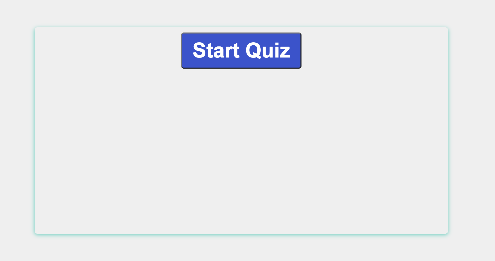

# Code Quiz

## [Deployed Application](https://amaryahwolf.github.io/code-quiz/)

## Description
This application is a multiple choice timed coding quiz that stores high scores using HTML and CSS, and dynamically powered by JavaScript. 

## Table of Contents
- [Installation](#installation)
- [Usage](#usage)
- [Credits](#credits)
- [License](#license)
- [Contributing](#contributing)
- [Tests](#tests)
- [Questions](#questions)

## Installation
To run the application, simply enter the URL in any browser.  
To install the application locally, clone the repository from GitHub and open the index.html file in a browser.

## Usage
To use the application, click on the "Start Quiz" button. A timer set for 60 seconds will begin counting down and the user will be presented with a series of multiple choice questions on JavaScript fundamentals. If a question is answered incorrectly, 10 seconds will be removed from the timer and 0 points will be added to the total score. If a question is answered correctly, 5 points will be added to the total score. After all questions are finished or the time runs out, the user will be presented with their total score and prompted to enter their initials to save their score. After entering initials, the user can view all of the higscores stored in the browser, and choose to take the quiz again.

## Credits
Collaborators: Amaryah Wolf

## License
This application is covered under the MIT license.

## Contributing
[Contributor Covenant](https://www.contributor-covenant.org/version/2/1/code_of_conduct/)

## Tests
N/A

## Questions
For additional questions, find me on [github](https://github.com/amaryahwolf) or email me at amaryahwolf@gmail.com.